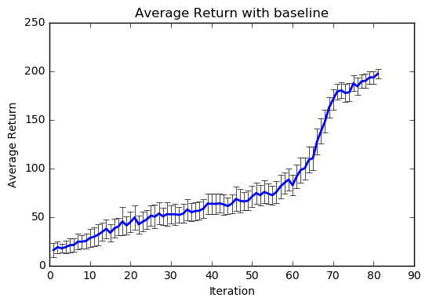
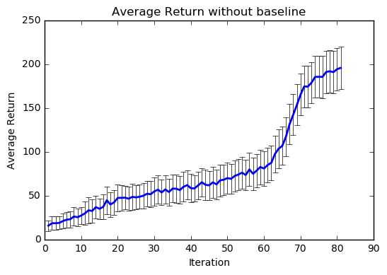

# Homework2 - Policy Gradient 
Please complete each homework for each team, and  
mention who contributed which parts in your report.

# Our report of this assignment
We present our report as a <a href="CEDL_HW2_Report.pdf">pdf file</a>.

# Problem 5
### Average_return_with_baseline.png

### Average_return_without_baseline.png

  上兩圖中的藍色線為Average Return值，而黑色線則表示Stardard Deviation範圍，上圖是有在Policy Gradient中加入Baseline，而下圖則無，可以看到Standar Deviation值具有明顯差異，換算則Variance的話，有加入Baseline大約可以減少Variance約300～400左右，而在Variance值減少的情況下，原本可預期減少iteration數，在實驗中也曾測到Iteration數減少約10～20，但是因為每次執行的結果都不同，所以這裡給的數值只是大概值。

# Problem 6
  針對Advantage進行Normalization的話能夠穩定Rewards中的variance大小的影響，進一步讓Iteration數趨於穩定，原預期此一步驟可讓Gradient趨於穩定，然而經多次實驗後卻發現Iteration數量不減反增，加入Normalization僅能讓加入Baseline的因素影響減少而已，因此判定Normalization可讓Training過程穩定。

# Team members and contribution
- 姓名：<a href="https://github.com/Timforce">李冠毅</a>　學號：104064510  
負責內容：數據圖，實驗討論，環境設置

- 姓名：<a href="https://github.com/gjlnnv">李季紘</a>　學號：(交大)0556083  
負責內容：程式設計，實驗討論，資料收集
