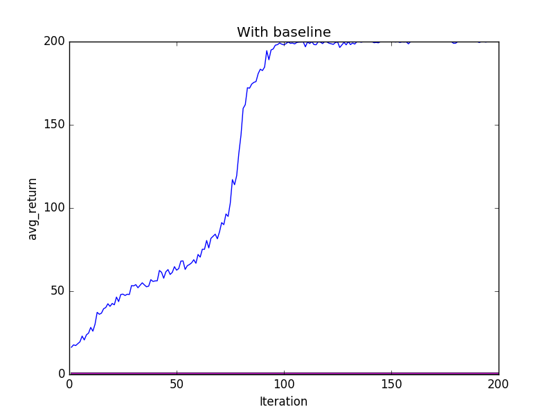
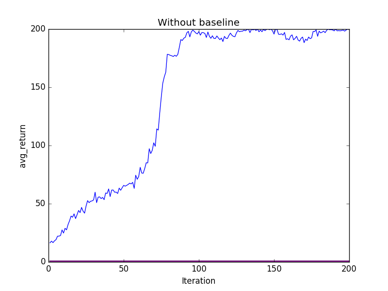

# Homework2 - Policy Gradient
Member: 簡廷安, 巫姿瑩, 胡展維

## Problem 1
We construct a two fully-connected layer for training.

    W1 = tf.Variable(tf.random_normal([in_dim, hidden_dim]))
    b1 = tf.Variable(tf.zeros([hidden_dim]))
    W2 = tf.Variable(tf.random_normal([hidden_dim, out_dim]))
    b2 = tf.Variable(tf.zeros([out_dim]))
    output1 = tf.nn.tanh(tf.matmul(self._observations, W1) + b1)
    probs = tf.nn.softmax(tf.matmul(output1, W2) + b2)

## Problem 2
It's very easy to implement surrogate loss using Tensorflow, but the optimizer in Tensorflow only minimize loss. So, we need to add a negative sign(Since we want gradient ascent).

    surr_loss = -tf.reduce_mean(tf.mul(log_prob, self._advantages))

## Problem 3
Accumulated reward

    def discount_cumsum(x, discount_rate):
        R = [x[-1]]
        for V in x[:-1][::-1]:
            R.append(V + discount_rate*R[-1])
    return np.array(R[::-1])

## Problem 4
Just simply do accumulated reward minus baseline

    a = r - b

## Problem 5
Compare the variance and performance before and after adding baseline (with figures is better)
Performance without adding baseline converge faster(69 iteraion v.s 81 iteration)

* Observations:
    * Initial value of policy is highly related to the convergence time. If it's a good initial value, then it reaches avg_return >= 195 faster.
    * Because we're trying to determine the best action for a state, we need a baseline to compare from. In theory, training with baseline should converge faster than without baseline; however, for this game, it's opposite. Our guess is that this game is too simple.
    * Next, we fix the iteration to 200, (It means that we don't stop training even the avg_return is more than 195), as following:   
        
           
      We found that roughly after 100 iteration, the avg_return with baseline almost converges to 200, and avg_return without baseline may cause some vibration. We thought it's because the variance of training without baseline is larger than with baseline, so it can't converge perfectly.

## Problem 6
The reason why we need normalized advantage function is that we want to get a better policy at each time step. When accumulating rewards, the reward we get at a time step is discounted by a factor. However, the later rewards are exponentially less important for the stimulation of action at current time step. Therefore, we normalize the advantage function over time steps to stimulate the action at each time step.

## Reference paper

[Continuous Deep Q-Learning with Model-based Acceleration](https://arxiv.org/abs/1603.00748)

[HIGH-DIMENSIONAL CONTINUOUS CONTROL USING GENERALIZED ADVANTAGE ESTIMATION](https://arxiv.org/pdf/1506.02438v5.pdf)
